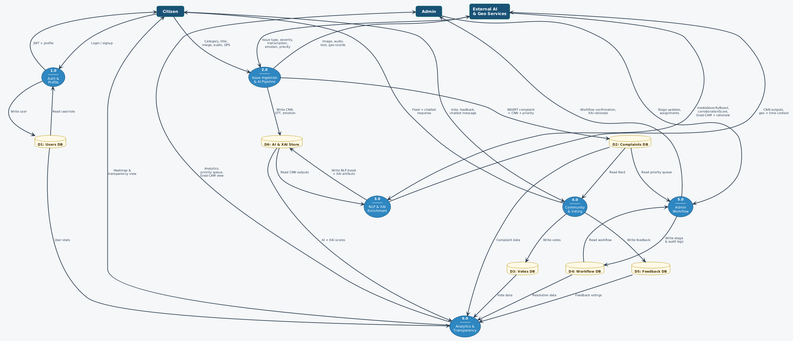
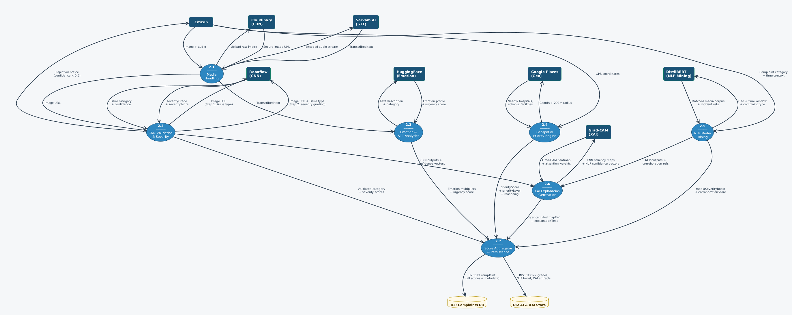
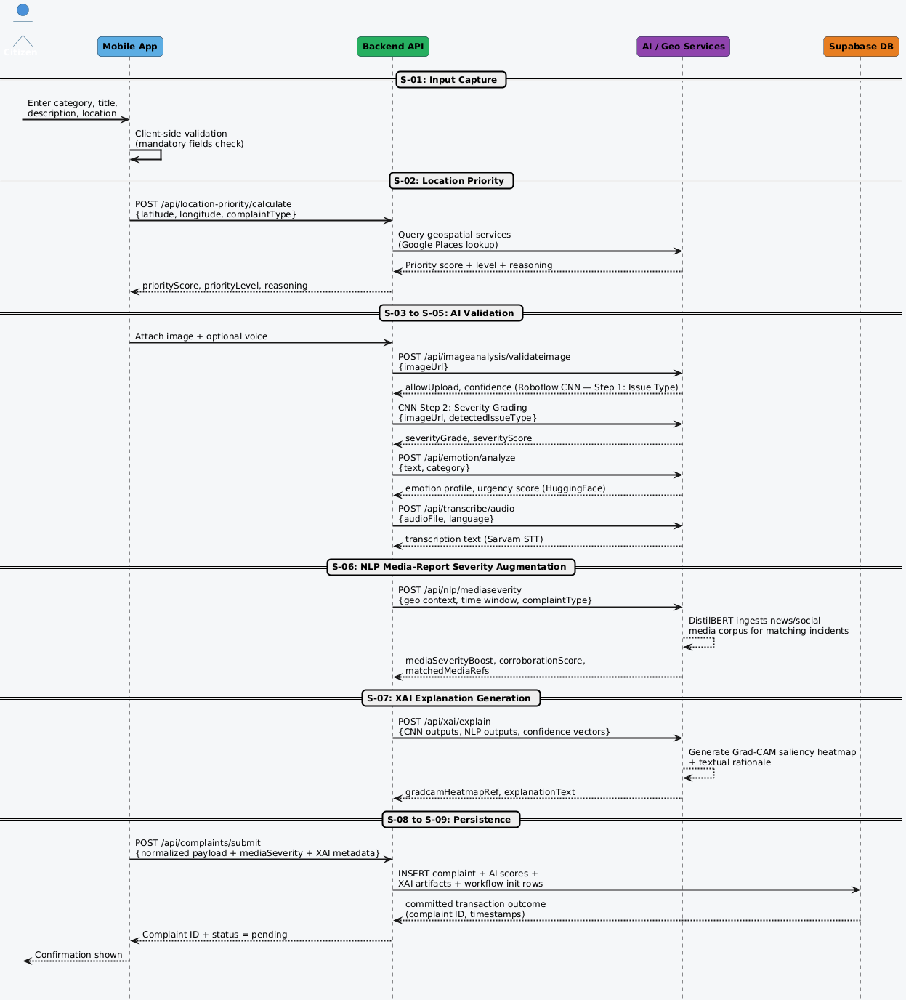

<p align="center">
  
  
  
  
</p>

# UrbanPulse Backend

**Intelligent Civic Complaint Management API** -- A Node.js/Express REST API powering the UrbanPulse platform with AI-driven image validation, emotion analysis, geospatial priority scoring, and real-time civic issue management.

---

## Table of Contents

- [Overview](#overview)
- [System Architecture](#system-architecture)
- [Key Features](#key-features)
- [Tech Stack](#tech-stack)
- [Getting Started](#getting-started)
- [Environment Variables](#environment-variables)
- [API Reference](#api-reference)
- [AI/ML Services](#aiml-services)
- [Database Schema](#database-schema)
- [System Design](#system-design)
- [Project Structure](#project-structure)
- [Deployment](#deployment)
- [Contributing](#contributing)
- [License](#license)

---

## Overview

UrbanPulse Backend is the server-side engine for a smart civic complaint management platform. It orchestrates a multi-stage AI pipeline that processes citizen-reported issues through image classification (Roboflow CNN), emotion analysis (DistilBERT/HuggingFace), voice transcription (Sarvam STT), and geospatial priority scoring (Google Places) to deliver intelligent, transparent, and explainable complaint prioritization.

---

## System Architecture

<p align="center">
  
</p>

The platform follows a layered microservices-inspired architecture:

- **Client Layer** -- Web and mobile frontends communicate via REST API
- **API Gateway** -- Express.js with JWT authentication and CORS management
- **Service Layer** -- Dedicated service classes for each AI/ML capability
- **Data Layer** -- Supabase (PostgreSQL) with row-level security
- **External Services** -- Roboflow, HuggingFace, Google Places, Sarvam AI, Cloudinary

---

## Key Features

| Feature | Description |
|---|---|
| **AI Image Validation** | Roboflow CNN workflow classifies uploaded images as valid civic issues with confidence scoring |
| **Emotion Analysis** | DistilBERT-based sentiment analysis extracts urgency from complaint text |
| **Voice Transcription** | Sarvam STT converts audio complaints to text with multi-language support |
| **Geospatial Priority** | Google Places API calculates proximity to hospitals, schools, and critical infrastructure |
| **Explainable AI (XAI)** | Grad-CAM saliency heatmaps and textual rationale for every AI decision |
| **Smart Priority Scoring** | Weighted composite score: 40% image + 20% emotion + 30% location + 10% community |
| **Civic Chatbot** | Gemini-powered chatbot with curated civic knowledge base |
| **Heat Map Analytics** | Geographic clustering of complaints for trend visualization |
| **Transparency Dashboard** | Public-facing resolution metrics and department performance |
| **Community Voting** | Upvote/downvote system with guest voting support |

---

## Tech Stack

| Layer | Technology |
|---|---|
| Runtime | Node.js 18+ |
| Framework | Express.js 4.x |
| Database | Supabase (PostgreSQL) |
| Authentication | JWT (jsonwebtoken) + bcryptjs |
| Image Processing | Sharp, Multer |
| AI/ML - Vision | Roboflow Serverless Workflows |
| AI/ML - NLP | DistilBERT (HuggingFace Inference) |
| AI/ML - Speech | Sarvam AI STT |
| Geospatial | Google Places API |
| Media Storage | Cloudinary |
| HTTP Client | Axios |
| Security | Helmet, CORS |
| Logging | Morgan |

---

## Getting Started

### Prerequisites

- Node.js 18 or higher
- npm 9+
- A Supabase project with the required schema
- API keys for external services (see Environment Variables)

### Installation

```bash
# Clone the repository
git clone https://github.com/your-org/UrbanPulse_Backend.git
cd UrbanPulse_Backend

# Install dependencies
npm install

# Configure environment
cp .env.example .env
# Edit .env with your actual credentials

# Start development server
npm run dev

# Or start production server
npm start
```

The server will start on `http://localhost:3001` by default.

### Health Check

```
GET /health
```

Returns `{ status: "OK", message: "UrbanPulse Backend Server is running" }` when the server is operational.

---

## Environment Variables

Create a `.env` file in the project root. See `.env.example` for the template.

| Variable | Required | Description |
|---|:---:|---|
| `SUPABASE_URL` | Yes | Your Supabase project URL |
| `SUPABASE_ANON_KEY` | Yes | Supabase anonymous/public API key |
| `JWT_SECRET` | Yes | Secret key for JWT token signing |
| `PORT` | No | Server port (default: `3001`) |
| `NODE_ENV` | No | Environment mode (`development` / `production`) |
| `ROBOFLOW_API_KEY` | Yes | Roboflow private API key |
| `ROBOFLOW_WORKSPACE` | Yes | Roboflow workspace name |
| `ROBOFLOW_WORKFLOW` | Yes | Roboflow workflow ID |
| `ROBOFLOW_MODEL_ENDPOINT` | Yes | Full Roboflow workflow URL |
| `ROBOFLOW_API_URL` | No | Roboflow API base (default: `https://serverless.roboflow.com`) |
| `GOOGLE_PLACES_API_KEY` | No | Google Places API key for geospatial scoring |
| `SARVAM_API_KEY` | No | Sarvam AI key for speech-to-text |
| `WIT_AI_TOKEN` | No | Wit.ai token for NLP intent parsing |
| `FRONTEND_URL` | No | Frontend origin for CORS |
| `QUICK_DEV_MODE` | No | Set `true` to bypass AI calls in development |

---

## API Reference

Base URL: `http://localhost:3001`

### Authentication

All protected routes require a JWT token in the `Authorization` header:

```
Authorization: Bearer <token>
```

---

### Auth Routes -- `/api/auth`

| Method | Endpoint | Description | Auth |
|:---:|---|---|:---:|
| POST | `/api/auth/signup` | Register a new citizen or admin account | No |
| POST | `/api/auth/login` | Authenticate and receive JWT token | No |
| GET | `/api/auth/profile` | Get current user profile | Yes |

**POST `/api/auth/signup`**
```json
{
  "email": "citizen@example.com",
  "password": "securepassword",
  "fullName": "Jane Doe",
  "phoneNumber": "9876543210",
  "userType": "citizen",
  "address": "123 Main Street"
}
```

**POST `/api/auth/login`**
```json
{
  "email": "citizen@example.com",
  "password": "securepassword"
}
```

Response:
```json
{
  "success": true,
  "token": "eyJhbGciOiJIUzI1NiIs...",
  "user": { "id": "uuid", "email": "...", "fullName": "...", "userType": "citizen" }
}
```

---

### Complaints -- `/api/complaints`

| Method | Endpoint | Description | Auth |
|:---:|---|---|:---:|
| POST | `/api/complaints/submit` | Submit a new complaint with AI scoring | Yes |
| GET | `/api/complaints/all` | Fetch all complaints with pagination | Yes |
| GET | `/api/complaints/personal-reports` | Get current user's complaints | Yes |

**POST `/api/complaints/submit`**
```json
{
  "title": "Large pothole on MG Road",
  "description": "Dangerous pothole near school zone causing accidents",
  "category": "pothole",
  "imageUrl": "https://res.cloudinary.com/...",
  "locationData": {
    "latitude": 13.0827,
    "longitude": 80.2707,
    "address": "MG Road, Chennai",
    "privacyLevel": "street"
  },
  "imageValidation": {
    "allowUpload": true,
    "confidence": 0.92
  }
}
```

Supported categories: `pothole`, `broken_streetlight`, `garbage_collection`, `sewage_overflow`, `water_main_break`, `fire_hazard`, `electrical_danger`, `traffic_signal`, `road_damage`, `illegal_parking`, `noise_complaint`, `structural_damage`, `others`

---

### Complaint Details -- `/api/complaint-details`

| Method | Endpoint | Description | Auth |
|:---:|---|---|:---:|
| GET | `/api/complaint-details/:id` | Get full complaint with history | Yes |
| GET | `/api/complaint-details/:id/progress` | Get complaint progress timeline | Yes |

---

### Image Analysis -- `/api/image-analysis`

| Method | Endpoint | Description | Auth |
|:---:|---|---|:---:|
| POST | `/api/image-analysis/validate-image` | Validate image via Roboflow CNN workflow | Yes |
| GET | `/api/image-analysis/categories` | Get supported civic issue categories | No |
| GET | `/api/image-analysis/test-connection` | Test Roboflow API connectivity | No |

**POST `/api/image-analysis/validate-image`**
```json
{
  "imageUrl": "https://res.cloudinary.com/your-image.jpg"
}
```

Response:
```json
{
  "success": true,
  "confidence": 0.87,
  "allowUpload": true,
  "message": "Detected Issue: pothole",
  "modelConfidence": 0.87,
  "openaiConfidence": 0.91
}
```

---

### Emotion Analysis -- `/api/emotion`

| Method | Endpoint | Description | Auth |
|:---:|---|---|:---:|
| POST | `/api/emotion/analyze` | Analyze text sentiment and urgency | Yes |

**POST `/api/emotion/analyze`**
```json
{
  "text": "The road is severely damaged and children are at risk",
  "category": "pothole"
}
```

---

### Voice Transcription -- `/api/transcribe`

| Method | Endpoint | Description | Auth |
|:---:|---|---|:---:|
| POST | `/api/transcribe/audio` | Convert audio to text via Sarvam STT | Yes |

---

### Chatbot -- `/api/chatbot`

| Method | Endpoint | Description | Auth |
|:---:|---|---|:---:|
| POST | `/api/chatbot/message` | Send message to civic chatbot | Yes |

**POST `/api/chatbot/message`**
```json
{
  "message": "How do I report a pothole?",
  "conversationHistory": []
}
```

---

### Heat Map -- `/api/heat-map`

| Method | Endpoint | Description | Auth |
|:---:|---|---|:---:|
| GET | `/api/heat-map/data` | Get geographic complaint clusters | Yes |
| GET | `/api/heat-map/statistics` | Get heat map statistics | Yes |

---

### Admin Routes -- `/api/admin` and `/api/admin-enhanced`

| Method | Endpoint | Description | Auth |
|:---:|---|---|:---:|
| GET | `/api/admin/dashboard` | Admin dashboard statistics | Admin |
| GET | `/api/admin/complaints/:id` | Get complaint by ID (admin view) | Admin |
| PUT | `/api/admin/complaints/:id/status` | Update complaint status | Admin |
| GET | `/api/admin-enhanced/complaints/priority-queue` | AI-ranked priority queue | Admin |
| GET | `/api/admin-enhanced/citizens` | Citizen account management | Admin |
| GET | `/api/admin-enhanced/citizens/:id/details` | Citizen profile details | Admin |

---

### Voting -- `/api/complaints` and `/api/guest-votes`

| Method | Endpoint | Description | Auth |
|:---:|---|---|:---:|
| POST | `/api/complaints/vote` | Upvote/downvote a complaint | Yes |
| POST | `/api/guest-votes/vote` | Guest voting (rate-limited) | No |

---

### Transparency -- `/api/transparency`

| Method | Endpoint | Description | Auth |
|:---:|---|---|:---:|
| GET | `/api/transparency/dashboard` | Public transparency metrics | No |

---

### Feedback -- `/api/feedback`

| Method | Endpoint | Description | Auth |
|:---:|---|---|:---:|
| POST | `/api/feedback/submit` | Submit resolution feedback (1-5 rating) | Yes |
| GET | `/api/feedback/stats` | Aggregated feedback statistics | Yes |

---

### Location Priority -- `/api/location-priority`

| Method | Endpoint | Description | Auth |
|:---:|---|---|:---:|
| POST | `/api/location-priority/calculate` | Calculate infrastructure proximity score | Yes |

---

## AI/ML Services

### 1. Image Analysis Service (Roboflow CNN)

The image validation pipeline uses a custom Roboflow workflow with two stages:

- **Step 1 -- Issue Type Detection**: A CNN model classifies the uploaded image into civic issue categories (pothole, garbage, streetlight, etc.) and returns a confidence score.
- **Step 2 -- OpenAI Fallback**: If the CNN confidence is below threshold (0.7), a secondary OpenAI vision model provides a second opinion.

Images are uploaded to Cloudinary first, and the secure URL is passed to Roboflow's serverless workflow API.

### 2. Emotion Analysis Service (DistilBERT)

Complaint text is analyzed for emotional urgency using a DistilBERT model hosted on HuggingFace Inference. The emotion profile (anger, fear, sadness, etc.) maps to an urgency multiplier that influences the final priority score.

### 3. Location Priority Service (Google Places)

When a complaint is submitted with GPS coordinates, the system:

1. **Detects area type** (dense urban, urban, suburban, rural) via facility density probing
2. **Searches nearby infrastructure** across 8 categories: hospitals, schools, police, fire stations, transit, government offices, banks, pharmacies
3. **Calculates proximity scores** with distance-weighted, density-adjusted scoring
4. **Applies complaint-type multipliers** (e.g., pothole near school gets 1.2x boost)

### 4. Chatbot Knowledge Base (Gemini)

The civic chatbot is powered by Google Gemini with a curated knowledge base covering complaint procedures, civic rights, government contacts, and platform usage guides.

### 5. Heat Map Service

Aggregates complaint locations into geographic clusters with density scoring for visualization on the map interface.

---

## Database Schema

The system uses Supabase (PostgreSQL) with the following core tables:

<p align="center">
  
</p>

| Table | Description |
|---|---|
| `users` | Citizen and admin accounts with JWT auth |
| `complaints` | Core complaint records with AI scores and location data |
| `complaint_updates` | Status change history and audit trail |
| `complaint_votes` | Upvote/downvote records per user per complaint |
| `feedback` | Resolution satisfaction ratings (1-5 scale) |

---

## System Design

### Use Case Diagram

<p align="center">
  
</p>

### Data Flow Diagram -- Level 0 (Context)

<p align="center">
  
</p>

### Data Flow Diagram -- Level 1

<p align="center">
  
</p>

### Data Flow Diagram -- Level 2 (AI Pipeline)

<p align="center">
  
</p>

### Sequence Diagram -- Complaint Submission

<p align="center">
  
</p>

### Activity Diagram -- End-to-End Workflow

<p align="center">
  
</p>

---

## Project Structure

```
UrbanPulse_Backend/
├── server.js                  # Application entry point
├── package.json               # Dependencies and scripts
├── .env.example               # Environment variable template
│
├── config/
│   └── supabase.js            # Supabase client initialization
│
├── middleware/
│   └── auth.js                # JWT authentication middleware
│
├── routes/
│   ├── auth.js                # Authentication endpoints
│   ├── complaints.js          # Complaint CRUD + AI priority scoring
│   ├── complaintDetails.js    # Complaint detail views + progress
│   ├── imageAnalysis.js       # Roboflow image validation routes
│   ├── emotion.js             # Emotion analysis endpoints
│   ├── chatbot.js             # Civic chatbot endpoints
│   ├── heatMap.js             # Heat map data endpoints
│   ├── transparency.js        # Public transparency dashboard
│   ├── feedback.js            # Resolution feedback
│   ├── admin.js               # Admin dashboard
│   ├── adminMinimal.js        # Enhanced admin operations
│   ├── locationPriority.js    # Geospatial priority endpoints
│   ├── transcribe.js          # Voice transcription
│   ├── simplified-votes.js    # Voting endpoints
│   ├── guest-votes.js         # Guest voting
│   ├── statistics.js          # Analytics endpoints
│   └── cloudinary.js          # Image upload proxy
│
├── services/
│   ├── imageAnalysisService.js       # Roboflow CNN integration
│   ├── EmotionAnalysisService.js     # DistilBERT emotion analysis
│   ├── LocationPriorityService.js    # Google Places geospatial scoring
│   ├── ChatbotKnowledgeBase.js       # Gemini chatbot service
│   ├── HeatMapService.js             # Heat map aggregation
│   └── FallbackLocationService.js    # Offline fallback scoring
│
├── database/
│   └── create_feedback_table.sql     # Database migration scripts
│
├── utils/
│   └── networkUtils.js               # Server configuration helpers
│
└── docs/
    └── diagrams/                     # Architecture and design diagrams
```

---

## Deployment

### Render (Recommended)

1. Push the repository to GitHub
2. Create a new **Web Service** on [Render](https://render.com)
3. Set the build command to `npm install`
4. Set the start command to `npm start`
5. Add all environment variables from `.env.example`
6. Deploy

### Docker

```dockerfile
FROM node:18-alpine
WORKDIR /app
COPY package*.json ./
RUN npm ci --only=production
COPY . .
EXPOSE 3001
CMD ["node", "server.js"]
```

---

## Error Handling

The API uses consistent error response formatting:

```json
{
  "success": false,
  "error": "Human-readable error message",
  "code": "ERROR_CODE",
  "details": "Technical details (development only)"
}
```

| HTTP Code | Meaning |
|:---:|---|
| 200 | Success |
| 400 | Bad Request -- missing or invalid parameters |
| 401 | Unauthorized -- invalid or missing JWT |
| 403 | Forbidden -- insufficient permissions |
| 404 | Not Found -- resource does not exist |
| 500 | Internal Server Error |

---

## Contributing

1. Fork the repository
2. Create a feature branch: `git checkout -b feature/your-feature`
3. Commit changes: `git commit -m "Add your feature"`
4. Push to branch: `git push origin feature/your-feature`
5. Open a Pull Request

---

## License

This project is licensed under the MIT License. See the [LICENSE](LICENSE) file for details.

---

<p align="center">
  Built with purpose by <strong>Team REZO</strong>
</p>
